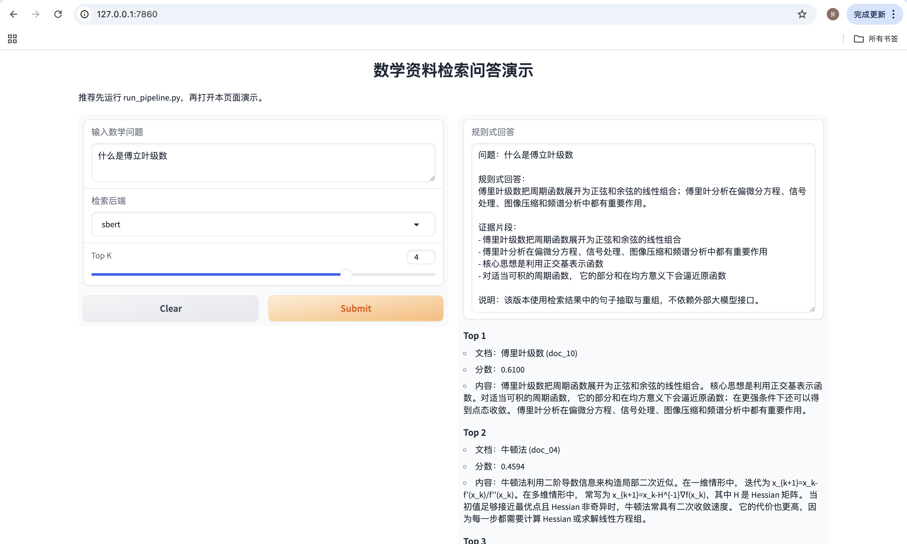

# 数学资料检索问答与评测系统

这是一个面向数学课程资料的检索增强项目。它围绕“文档清洗 → 文本切块 → 检索 → 回答生成 → 评测 → 演示页面”构建了一条完整闭环。

## 项目亮点

- 把原始数学资料整理成统一 `jsonl` 语料格式
- 对长文档做带重叠的切块，减轻定义句被切断的问题
- 支持 `TF-IDF` 检索；可选 `SentenceTransformer` 向量检索
- 提供规则式回答 baseline，先跑通“检索 + 回答”闭环
- 输出 `Recall@1 / Recall@3 / Recall@5` 和回答评测模板
- 自带 `Gradio` 页面，方便演示项目效果
- 支持一键运行主流程

## 目录结构

```text
math-rag-eval/
  README.md
  FILE_GUIDE.md
  requirements.txt
  .gitignore
  prepare_corpus.py
  chunk_docs.py
  build_index.py
  retrieve_demo.py
  generate_answer_rule.py
  generate_answer_api.py
  evaluate_retrieval.py
  evaluate_answers.py
  run_pipeline.py
  app.py
  rag_utils.py
  answer_utils.py
  data/
    raw/
      source_txt/
      eval_queries.jsonl
  artifacts/
  docs/
    project_report.md
```

## 环境安装

```bash
pip install -r requirements.txt
```

## 数据准备

- 把原始数学资料放到 `data/raw/source_txt/`
- 每个文件建议使用 `.txt` 格式
- 推荐文件名格式：`doc_01_压缩映射原理.txt`
- 评测问题放到 `data/raw/eval_queries.jsonl`

本项目已经自带一份小型示例语料，便于直接运行。后续你可以把 `source_txt` 和 `eval_queries.jsonl` 替换成你自己的资料。

## 快速开始

先运行主流程：

```bash
python run_pipeline.py --backend tfidf
```

然后分别体验检索、回答和页面演示：

```bash
python retrieve_demo.py --query "什么是压缩映射原理？" --backend tfidf --topk 3
python generate_answer_rule.py --query "什么是压缩映射原理？" --backend tfidf --topk 3
python app.py
```

若你已经安装好 `sentence-transformers` 并能下载模型，也可以试：

```bash
python run_pipeline.py --backend sbert
```

## 方法说明

### 1. 文档整理
`prepare_corpus.py` 从 `source_txt` 目录读取资料，整理成 `docs.jsonl`。这样后续切块、建索引、评测都只依赖统一格式的数据。

### 2. 文本切块
`chunk_docs.py` 默认使用 `chunk_size=220`、`overlap=40` 做重叠切块。重叠区域可以减少定义句或条件句在块边界处被切断。

### 3. 检索
- `TF-IDF` 版本使用中文字符 n-gram，适合短查询与术语匹配
- `SBERT` 版本使用多语言句向量，适合更语义化的检索

### 4. 回答生成
- `generate_answer_rule.py`：规则式 baseline，依赖检索证据做句子抽取与重组
- `generate_answer_api.py`：可选增强版，在检索证据基础上调用 OpenAI 兼容接口生成答案

### 5. 评测
- `evaluate_retrieval.py`：输出 `Recall@1 / Recall@3 / Recall@5`
- `evaluate_answers.py`：输出关键词覆盖率，以及人工打分模板

## 当前示例结果

使用自带示例语料与 `TF-IDF` 后端跑通主流程后，当前示例结果为：

- `R@1 = 0.9583`
- `R@3 = 1.0000`
- `R@5 = 1.0000`
- `平均关键词覆盖率 = 0.8125`

结果文件会保存在 `artifacts/` 目录中，包括：

- `retrieval_eval_tfidf.csv`
- `retrieval_summary_tfidf.json`
- `answer_eval_tfidf.csv`
- `answer_summary_tfidf.json`
- `sample_retrieval.txt`
- `sample_answer.txt`

## 演示截图



## 后续可优化方向

- 增加 reranker，提升 top-k 结果排序质量
- 引入更细粒度 chunk 策略，例如按段落或标题切块
- 扩大评测集，覆盖更多“相似问题不同问法”
- 在 API 版回答中加入引用证据位置
- 为回答结果增加自动 hallucination 检查
